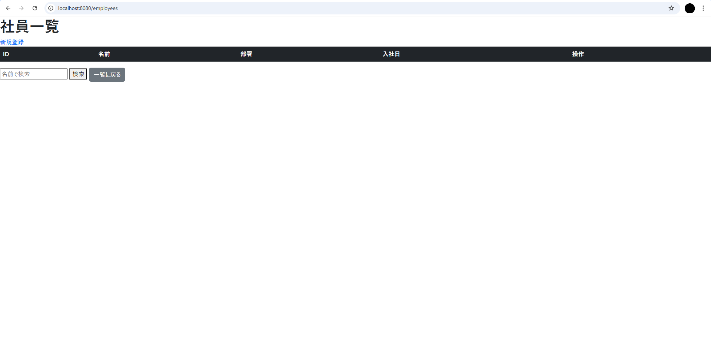
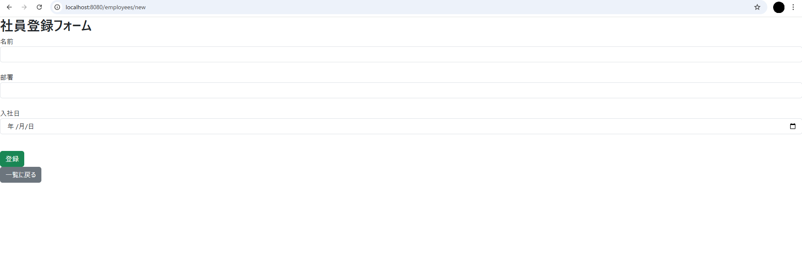

#社員管理システム(employee-management)
---
## 概要
Spring Bootを使用して作成した社員情報管理システムです。<br>社員の登録・編集・削除・検索・バリデーションを行うことができるWebアプリケーションです。

未経験から開発エンジニアを目指す中で、Webアプリケーションの基本構造とデータベース連携を理解するために作成しました。

---
## 使用技術

| 分類 | 技術 |  
| ------ | ----- |  
| 言語 | Java 17 |  
| フレームワーク | Spring Boot 3.5.6 |  
| テンプレートエンジン | Thymeleaf |  
| データベース | H2 Database （組み込みDB） |  
| ORM | Spring Data JPA |  
| フロントエンド | HTML / CSS / Bootstrap 5 |  
| ビルドツール | Maven |  

---
## 機能一覧  

✅ 社員情報の登録（名前・部署・入社日）  
✅ 社員情報の編集・削除  
✅ 名前による部分一致検索  
✅ 入力値チェック（バリデーション）  
✅ 入力値の過去日チェック  
✅ エラーメッセージの外部化（ `messages.properties` ）  
✅ Bootstrapによるデザイン  

---
## 機能詳細  
| 機能 | 説明 |  
|------|------|  
| 一覧表示 | 社員情報をテーブルで一覧表示 |  
| 検索機能 | 名前を部分一致で検索（例：「山」で「山田」「山本」をヒット） |  
| 新規登録 | フォーム入力後にDBへ登録 |  
| 編集 | 既存社員情報を編集 |  
| 削除 | 削除確認ダイアログ表示後に削除 |  
| 入力チェック | 空欄・未来日などをバリデーション |  
| メッセージ外部化 | バリデーションメッセージを `messages.properties` に集約 |  
| デザイン | Bootstrapで整えたUI |  

---

## 画面イメージ

| 一覧画面 | 登録画面 |
|-----------|-----------|
|  |  |

---

## 起動方法

### 前提
- JDK 17 がインストール済み
- Maven が使用可能（`mvn -v` で確認）

### 実行手順

#### プロジェクトルートで
mvn spring-boot:run
#### ブラウザで以下にアクセス
http://localhost:8080/employees

---
## 学んだこと  
・Spring BootのMVC構成  
・Entity,Repository,Controller,Viewの役割分担  
・バージョンエラーや依存関係 

---
## 工夫点
・バリデーションの仕組み（@NotNull,@PastOrPresentなど）  
・メッセージの外部化による保守性向上  
・BootstrapによるUIデザイン改善  

---
## ディレクトリ構成
```
employee-management/  
 ├─ src/  
 │   └─ main/  
 │      ├─ java/com/example/demo/  
 │      │    ├─ controller/　　      # コントローラ層  
 │      │    ├─ entity/         　　 # エンティティ（モデル）  
 │      │    ├─ repository/     　　 # データアクセス層  
 │      │    └─ EmployeeManagementApplication.java  
 │      └─ resources/  
 │           ├─ templates/      　   # Thymeleafテンプレート  
 │           ├─ static/         　   # CSS / JS  
 │           ├─ messages.properties  
 │           └─ application.properties  
 ├─ pom.xml  
 ├─ README.md  
 └─ screenshots/
```
 ---
## 制作者コメント
未経験からエンジニアを目指し、その第一歩として作成しました。  
フォームの入力値保持やバリデーションメッセージ外部化にこだわりました。  
現場で通用する基礎スキルの習得を目的としています。  
しかし、まだまだ理解できていない部分も多いので、ログイン機能や外部DB接続といった機能を拡張したり、  
別のアプリケーションを制作したりして更なるスキルの向上を目指します。  

---
## ライセンス
このプロジェクトは個人学習目的で制作されています。


